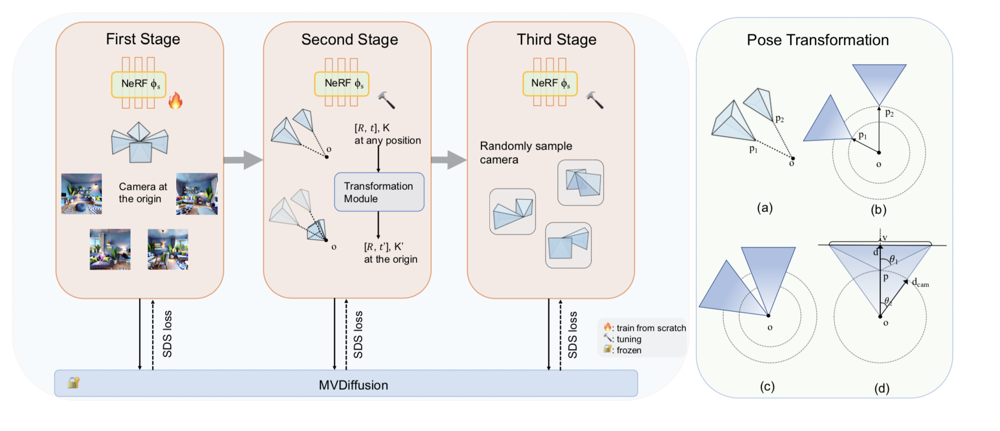

# ShowRoom3D: Text to High-Quality 3D Room Generation Using 3D Priors

This is the official repository of **ShowRoom3D** [Project page](https://showroom3d.github.io/) | [arXiv](https://arxiv.org/abs/2312.13324) | [Video](https://www.youtube.com/watch?v=jenWb09pW4s)

 [Weijia Mao](https://scholar.google.com/citations?view_op=list_works&hl=zh-CN&user=S7bGBmkyNtEC), [Yan-Pei Cao](https://yanpei.me), [Jia-Wei Liu](https://jia-wei-liu.github.io/), [Zhongcong Xu](https://scholar.google.com/citations?user=-4iADzMAAAAJ&hl=en), [Mike Zheng Shou](https://sites.google.com/view/showlab)

  
 
<em>ShowRoom3D Framework.</em>

